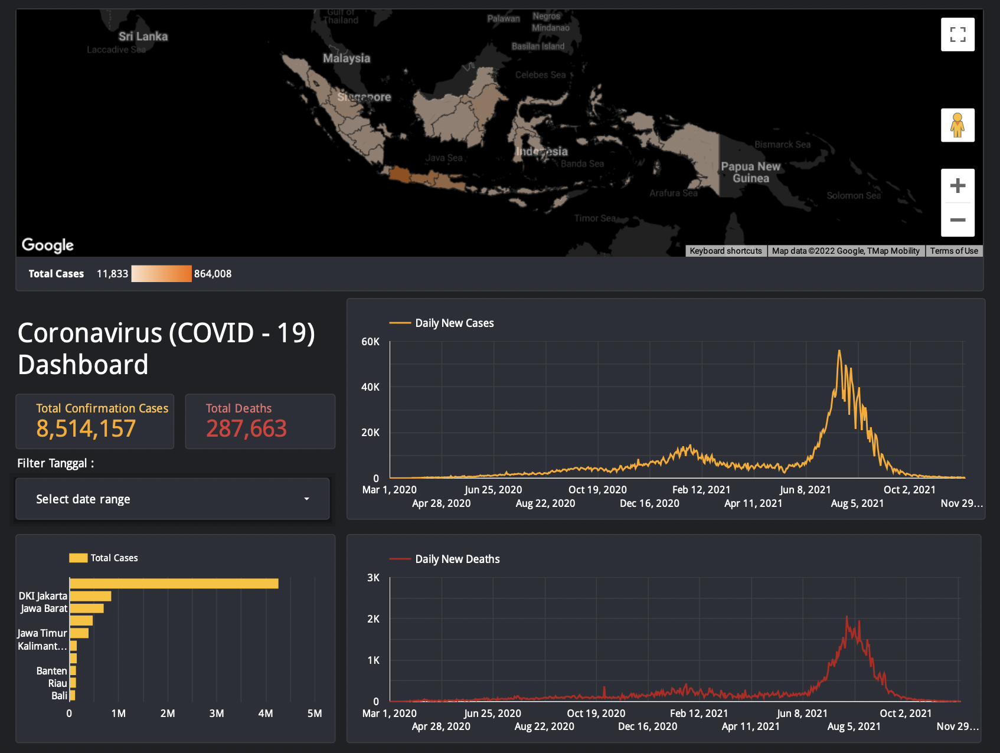

<h1 align="center">Explore Data Covid</h1>

  Repositori ini berisi tentang hasil pembelajaran saya dalam mengeksplor data penyebaran virus COVID-19 yang saya visualisasikan menggunakan aplikasi <strong>Tableau</strong> dan <strong>Google Data Studio</strong> .

  Tools Visualisasi : 

 

  Source Data :

  

Portofolio Dashboard Tableau

  

 

  <strong>Dashboard Diatas berisi informasi terkait data penyebaran virus COVID-19 di indonesia yang divisualisasikan menggunakan Tableau.</strong>

  

Portofolio Dashboard Google Data Studio

  

 

  <strong>Dashboard Diatas berisi informasi terkait data penyebaran virus COVID-19 di indonesia yang divisualisasikan menggunakan Google Data Studio.</strong>

  

  Notes : Link menuju Tableau Public atau Google Data Studio bisa klik logo Tableau atau Google Data Studio di atas.

